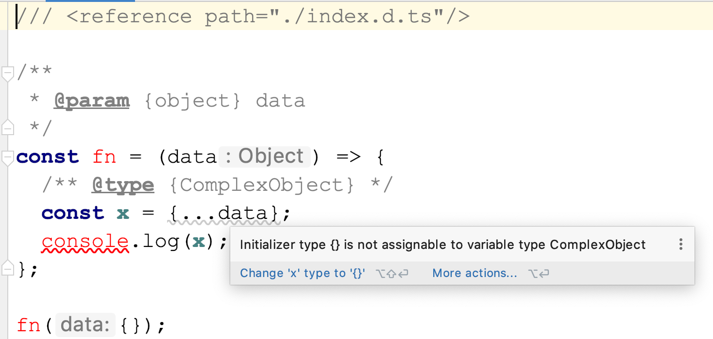

# WebStorm vs. tsc typechecking

The code in [index.js](index.js) is type checked but **WebStorm and tsc behave differently when checking the types**, why?  
Note: in case it is important, this is NOT using `*.ts` files, but verifying type safety for `*.js` files.

For some reason `tsc` does NOT report a type error, even though there is one in line 8.
See the result of the typecheck below.

```bash
> ./run.sh npm run typecheck
--- RUNNING container 'tscvsws'---

> tsc-vs-webstorm-typechecking@1.0.0 typecheck /home/node/app
> tsc

```

But WebStorm does report a type error, see the picture below. 



How can I make `tsc` report this error too? Tbh I want this error to stop my code from being valid.

## How to use

Since nobody has node installed globally on a machine anymore, the environment to run this code
in is provided by docker.  
One can use this repo in multiple ways to work with the code:
- `./run.sh /bin/bash` will drop you in a shell which has node and npm installed, e.g. you can run `npm run typecheck` or `npm i`
- `./run.sh npm install` runs the npm command inside the docker container and return to the original shell afterwards
- `./run.sh npm run typecheck` runs the typecheck, you can put any other npm or node call after `./run.sh` to execute it
